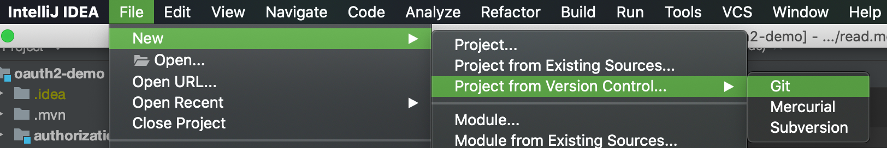
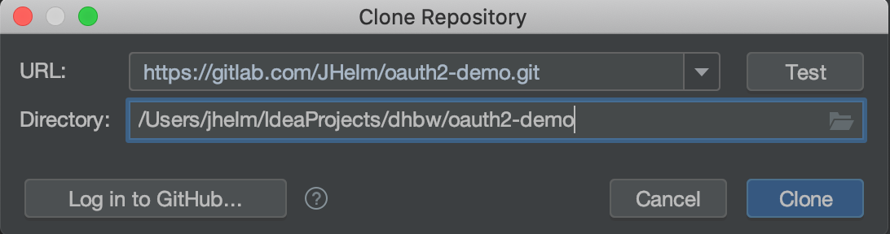
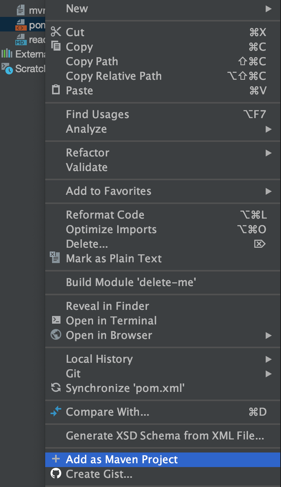

## Clone the project with IntelliJ
1. create a new project by selecting **project from version control...** > **Git**

2. clone the project by https if you don't want to authenticate yourself

3. you have to initialize the project as maven project. so select the root pom.xml and **add as Maven Project**


## Run the project with Maven
For running on of the modules you can simply run 
```
password/main/java/de/dhbw/jhelm/PasswordApplication.java
```
or 
```
authorization_code/main/java/de/dhbw/jhelm/AuthorizationCodeApplication.java 
```
automatically or by using the Maven Wrapper if you haven't installed Maven yet:

```shell script
cd password/ 
#or 
cd authorization_code/

../mvnw spring-boot:run
```


