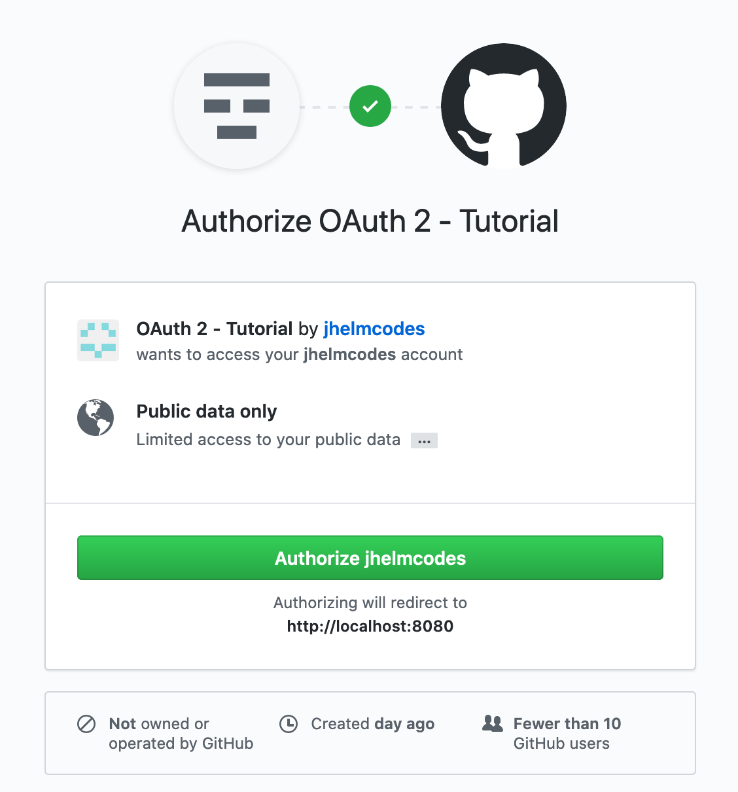

## OAuth 2.0 and Spring Boot - Tutorial

### application_code workflow with Github
1. Checkout the **oauth2-demo** project
2. Login into **Github**
3. Click on the link https://github.com/settings/applications/new or go to **settings/Developer settings/OAuth2 Apps** and click on **New OAuth App**
4. Register your application. The homepage defines the link to the start page of your application. The callback URL the redirect link after a successful login and authorization.

5. Your new registered application will show up under settings/applications and in settings/developer settings/OAuth Apps

6. Copy the **client id** and the **client secret** and replace those values in the module authorization_code
/src/main/resources/application.yml
    ```
    security:
      oauth2:
        client:
          clientId: <ID>
          clientSecret: <SECRET>
          accessTokenUri: https://github.com/login/oauth/access_token
          userAuthorizationUri: https://github.com/login/oauth/authorize
          clientAuthenticationScheme: form
        resource:
          userInfoUri: https://api.github.com/user
    ```
7. Start your application and go to http://localhost:8080
8. Click on **With Github: click here**
9. You will be redirected to the login form of github

10. Authorize github to share their user information with your application

11. You will be redirected to the callback URL (in this case the start page under /)
and see some user information that is shared by github
12. To view all of your user data you can go to /user or /me where it is listed in a JSON object
13. In your developer settings of github you can now see that one user has logged in and authorized the application


### Define private and public pages
1. For restricting access to your application you need a class that extends from **WebSecurityConfigurerAdapter** that is made available by Spring Security
    ```
    <dependency>
        <groupId>org.springframework.boot</groupId>
        <artifactId>spring-boot-starter-security</artifactId>
    </dependency>
    ```
2. In that class you have to override the method configure(HttpSecurity)

3. With the matcher above **permitAll** you can define a list of URLs or their Wildcards that a visitor can access without any login
4. **anyRequest().authenticated()** is then restricting any other not defined request and is forcing an authentication for those

Alternative: overwrite the configure(HttpSecurity)-Method in your own ResourceServer extending from **ResourceServerConfigurerAdapter**
```
<dependency>
    <groupId>org.springframework.security.oauth</groupId>
    <artifactId>spring-security-oauth2</artifactId>
</dependency>
```

